# **Cockapoo Club**, Dublin Ireland
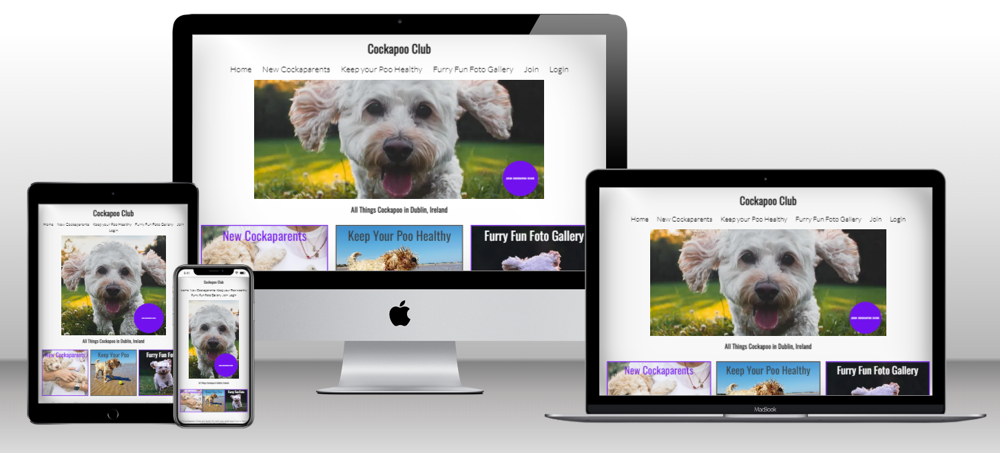

**[Cockapoo Club, Dublin Ireland](https://home-cockapoo-club-pp4.herokuapp.com)** was developed and submmitted as my fourth Profile Portfolio Project as part of the Code Institute's Diploma in full-stack software development course. 

This project introduces a new range of features and funcionalities that offer Users a valuable expansion on my first Profile Portfolio Project, which centred on a fictional webiste for an online community of dog owners called 'Cockapoo Club'. The progress made in this iteration of the original concept includes the addition of Django, CRUD functionality, as well as other new features that evolved out of ideas for delivering signifcant improvements and a fuller experience for Users of this website. 

- **[Click Here](https://home-cockapoo-club-pp4.herokuapp.com/)** to see the deployed website. 

- To view the repository on Github **[Click Here](https://github.com/SamOBrienOlinger/Cockapoo-Club-PortProj4)**.

- This website was designed for Desktop users first and is responsive for users of smaller devices.  

## **Summary**
  This website provides users with a starting point for all kinds of information about owning, training and taking care of a breed of dog called Cockapoos, one of Ireland's newest, most popular and much-loved dog breeds. 
  
  Unlike many other websites that provide similar information this project offers users a unique opportunity to create and participate in their own community of likeminded pet owners at a fictional physical clubhouse and training centre in person in Dublin, Ireland.   

The site targets users in Dublin, Ireland who:

* may already have a Cockapoo dog and need more information about taking care of their dog. 

* may be thinking about getting a new Cockapoo dog and require more information to make their decision. 

What makes this website stand out from other websites that provide useful information about this dog breed and becoming a new owner; is how it targets users who: 

 * may already be Cockapoo owners and are interested in connecting with and learning from other Cockapoo owners. 

* will find Cockapoo Club gives them a unique opportunity to join their own community and to network with other Cockapoo owners face-to-face.

* will enjoy sharing photographs of their pets online.  

Perhaps most importantly, the new feature added with CRUD functioanlity allows users who need support with training their dog to book a free training session in a group setting or choosing the option of a more intesive 0ne-to-one session.

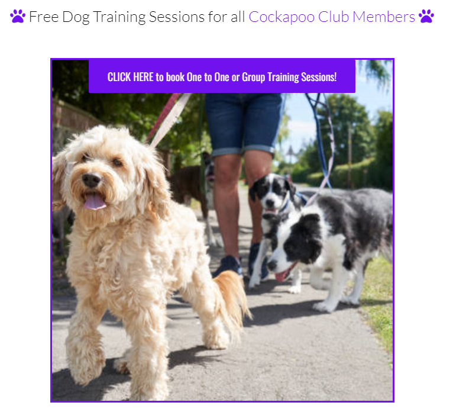

### **CRUD functionality**

Cockapoo Club now offers an Admin and Users a Create, Read, Update and Delete functionality:

- *Create* - new (un-authenticated) users can now register with or 'Join' Cockapoo Club to create a user account, and memebers (authenticated users) can view the [Furry Fun Foto Gallery](https://home-cockapoo-club-pp4.herokuapp.com/furryFunFotoGallery/) and [book dog training sessions](https://home-cockapoo-club-pp4.herokuapp.com/booking/).

- *Read* - authenticated users can view all of the dog training sessions they have booked.

- *Update* - authenticated users can reschedule any of their bookings by changing a booking to their new preferred time and date.

- *Delete* - authenticated users can cancel any of their bookings.
    

## **[Contents](#contents)**

- **[Features](#features)**
- **[Agile Development and User Stories](#agile-development-and-user-stories)**
- **[Deployment](#deployment)**
- **[Features Left to Implement](#features-left-to-implement)**
- **[Testing](#testing)**
- **[Unfixed Bugs](#unfixed-bugs)**
- **[Technologies and Tools](#technologies-and-tools)**
- **[Credits](#credits)**
- **[Acknowledgements](#acknowledgements)** 

## **[Features](#features)**

Themain front-end webpages are:

* [Homepage](#homepage)
* [New Cockaparents](#new-cockaparents)
* [Keep Your Poo Healthy](#keep-your-poo-healthy)
* [Furry Fun Foto Gallery](#furry-fun-foto-gallery)
* [Registration](#registration) (sign in / sign up)
* [Booking a Dog Training Session](#booking-a-dog-training-session)

### **[Homepage](#homepage)** 

#### **Content on Homepage**
  - The landing page immediately engages the user with a large [hero image](#hero-image) that zooms forward. The image is of a friendly happy Cockapoo running towards you with excitement. The zoom forward feature aims to remind the user of this real-life situation, in order to illicit a positive emotional response from the user from the very start of their experience on the website.  

    #### **[Hero image](#hero-image)**

    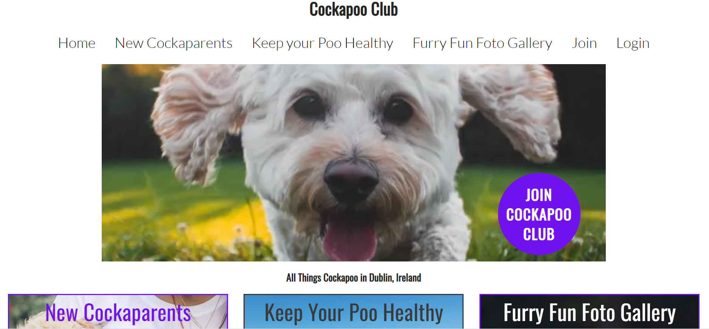

  - The hero image and also has cover text of JOIN COKCAPOO CLUB with an immediate call to action which brings the user to the Join page in order to encourage the user to sign up and become a member of this unique community. This was inspired by Code Institute's [Love Running Project](https://code-institute-org.github.io/love-running-2.0/index.html) image and the module where we learn to "square a circle". 
 
      

      The CSS code that was particularly useful for this can be found on lines 94 to 112 [Here](https://github.com/Code-Institute-Solutions/love-running-2.0-sourcecode/blob/main/03-creating-the-hero-image/03-hero-image-cover-text/assets/css/style.css). For more details in this README.md file, please click on [Code](#code). However, I changed many of the fixed units of measurement to dynamic units; changed the font-size; made the color consistent with the color scheme across the rest of this project; and had to explore and test a lot of positions of this feature on multiple screen sizes to ensure responsiveness. 

  #### **[Navigation bar](#navbar)**

   - Featured on all five pages, the full responsive navigation bar includes links to the Logo, Home page and all other pages. The navigation bar is identical in each page to allow for easy navigation.

   - This section will allow the user to easily navigate from page to page across all devices without having to revert back to the previous page via the ‘back’ button. Each page has a feature that tells the user which page they are on via the specific page the user is on having the corresponding navigation bar option highlighted with an underline: 

  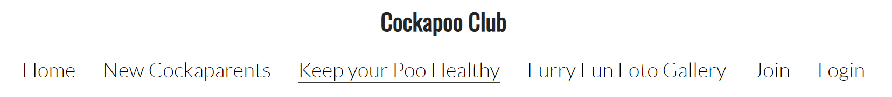 

      

  - The main element is divided into three sections with different purposes and value for the user, depending on what kind of information they are looking for. 
  
   - Free-to-use background images were used for each of the three main options that bring the user to a new page within the website: 
  
     - [New Cockaparents](https://home-cockapoo-club-pp4.herokuapp.com/newCockaparents/)
   
      - [Keep Your Poo Healthy](https://home-cockapoo-club-pp4.herokuapp.com/keepYourPooHealthy/) 
    
       - [Furry Fun Foto Gallery](https://home-cockapoo-club-pp4.herokuapp.com/furryFunFotoGallery/) (User is required to join / login to view this webpage)

       - [Book a Training Session](https://home-cockapoo-club-pp4.herokuapp.com/booking/) (User is required to join / login to view this webpage)

   - After these main pieces of content, there is an area with a map and information about the clubhouse and training centre, as well as another call to action to join Cockapoo Club with hyperlinked text to give users even more opportunities to register to join. 
   
   - Below is an image of the embedded map regarding the clubhouse and training centre for users to locate Cockapoo Club's premises.  
   
  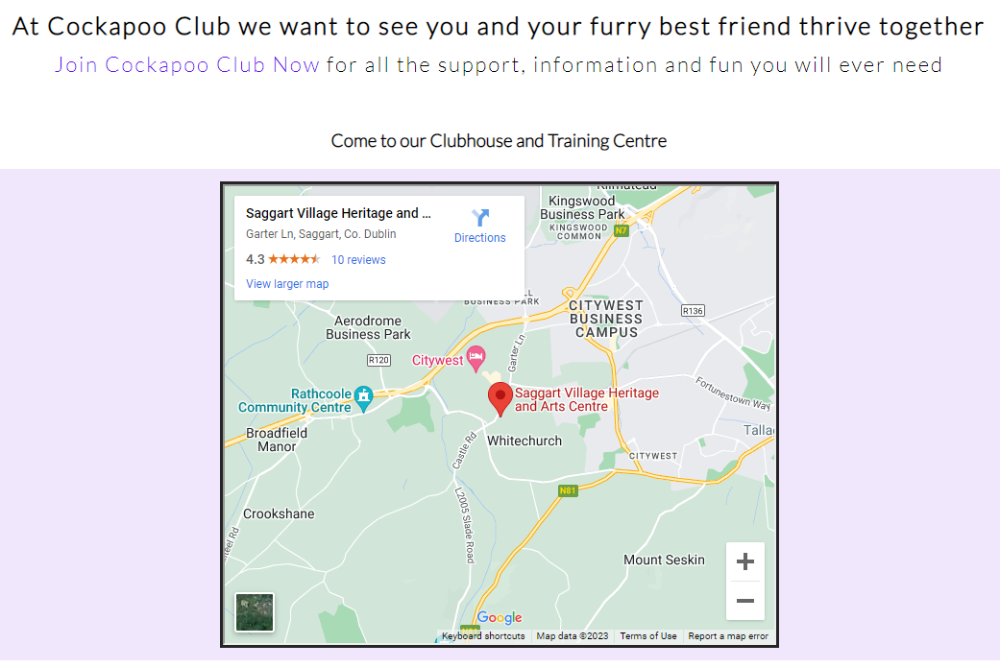
  
  ### **[New Cockaparents](#new-cockaparents)**

  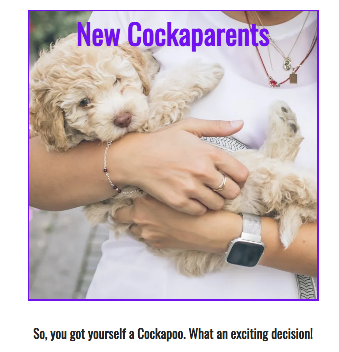 

  - For people who will become cockapoo owners for the first time the [New Cockaparents](https://home-cockapoo-club-pp4.herokuapp.com/newCockaparents/) page provides the user with a starting point for learning more about becoming a new owner of a Cockapoo, with evidence-based information linking to credible sources on other websites which help new owners plan and adjust to their new member of the family. 

  - To ensure a positive user experience, all internal links to this page bring the user to a specific point lower down the page when they land with a familiar image and heading consistent with the option they chose on the homepage that matches their expectations. This feature is applied across the entire website.  

### **[Keep Your Poo Healthy](#keep-your-poo-healthy)**

  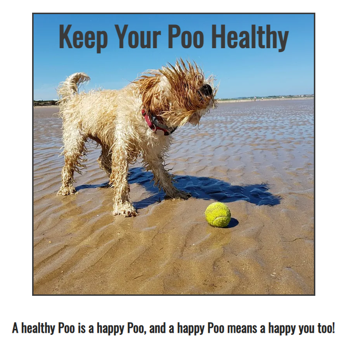

  - For people who want to learn more about maintaining their pet's wellbeing, there is the section called 'Keep your Poo healthy'. [Keep Your Poo Healthy](https://home-cockapoo-club-pp4.herokuapp.com/keepYourPooHealthy/) provides the user with a starting point for finding out more information about taking good care of a Cockapoo, with evidence-based information linking to credible sources on other websites to help owners take care of the health needs of their pet.

  - Similar to the New Cockaparents page, the same features were applied regarding internal links and landing on this new page that guarantee consistency while meeting the user's need for familiarity and expectations of engaging with new content. 

### **[Furry Fun Foto Gallery](#furry-fun-foto-gallery)**

  

  - The [Furry Fun Foto Gallery](https://home-cockapoo-club-pp4.herokuapp.com/furryFunFotoGallery/) section is intended for users to peruse and upload images of their pets.

  - After researching other websites and social media that provide dog owners with relevant valuable information, it was clear that dog owners enjoy being part of a community with this same shared interest in their pets. Joining a unique online collective is a priority for many users who love to see images of other people's pets and want to share images and information about their own pet and personal experiences.

  - This photo gallery idea was borrowed from the Love Running Project, which also seemed to capture the demand of users to participate in an online setting with other likeminded users through sharing relevant images. This feature aims to add more value to the overall educational and informative purpose of the site. 

  - Making the gallery responsive was challenging given the very different sizes of the photographs chosen. However, [Create Responsive Image Gallery Using HTML and CSS](https://www.youtube.com/watch?v=Trw_9lisYVY), a YouTube tutorial produced by [Tech2 etc](https://tech2etc.com/) was very helpful. The code for this gallery is based on the explanation found in this video.   

### **[Registration](#registration)**

  **Sign up feature**
  - An important feature of the website that provides value for users is the opportunity to become a member of Cockapoo Club. [The join or signup page](https://home-cockapoo-club-pp4.herokuapp.com/accounts/signup/) provides Users with a form to register a new account so they can view the exclusive content on the Furry Fun Foto Gallery page and to book a dog training session.    

  - This builds on the concept outlined in the above section regarding the clubhouse and training centre as well as the Furry Fun Foto Gallery.  A physical space where Cockapoo owners and their pets can meet in person. The opportunity to meet and benefit membership in-person makes this website and concept different to most other purely online communities that can easily be found on social media platforms yet do not involve members meeting face-to-face with their pets for mutual benefit and free peer-support.

   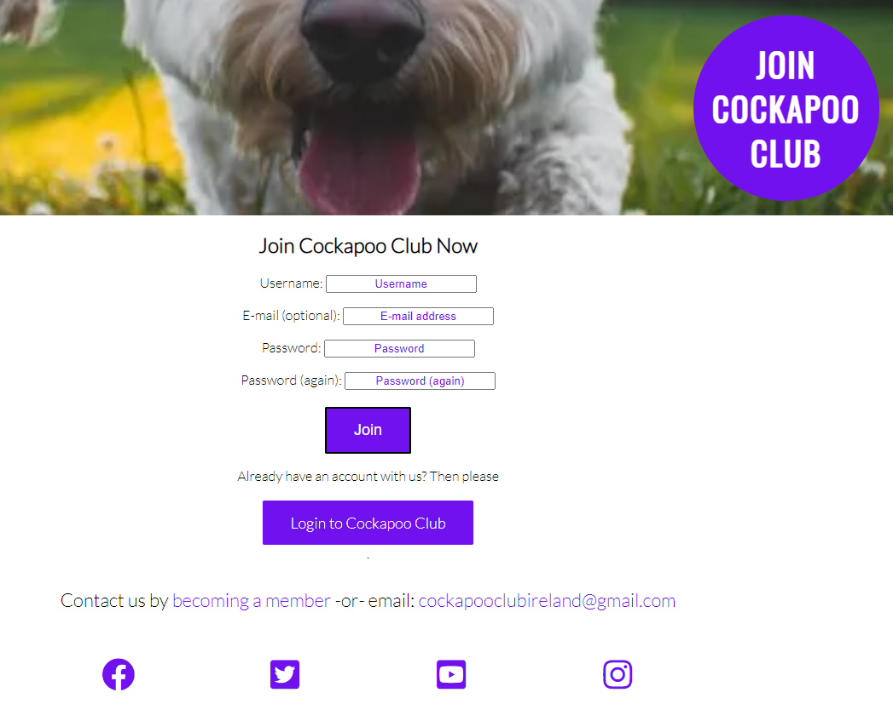

**Sign in feature**

- Once a User has registered an account they can also avail of the functionality that allows them to book a dog training session and view the Furry Fun Foto Gallery page. 

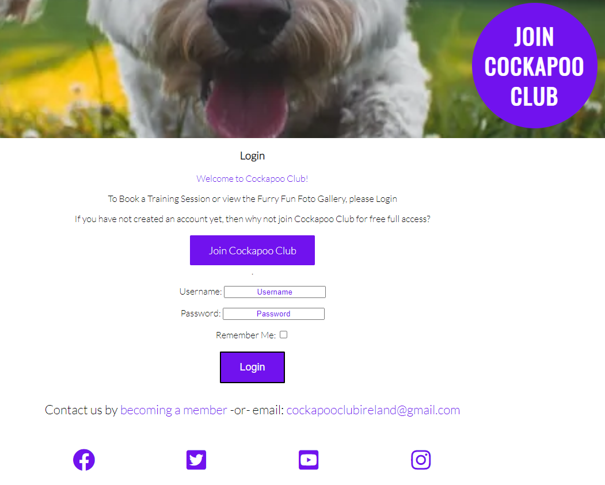

### **[Booking a Dog Training Session](#booking-a-dog-training-session)**

  

By importing Django's booking model, the framework allows autehticated Users to use a drop down calendar feature for scheduling a dog training session on a one-to-one basis, or to train as part of a group of owners and dogs. 

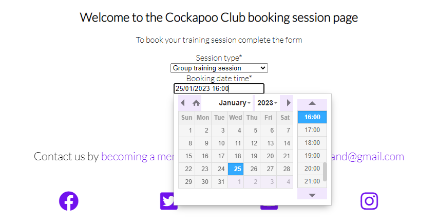

## **[Agile Development and User Stories](#agile-development-and-user-stories)**

Initial planning and ideas for new and improved features and funcitonalities for the site, themes, epics, User Stories and tasks were drafted using a Microsoft Word document and Blank Board free to use wireframe tool. 
These were subsequently re-drafted in more detail and inputted into a kanban board within a new Project in my Github Profile. 

- ### Draft wireframe

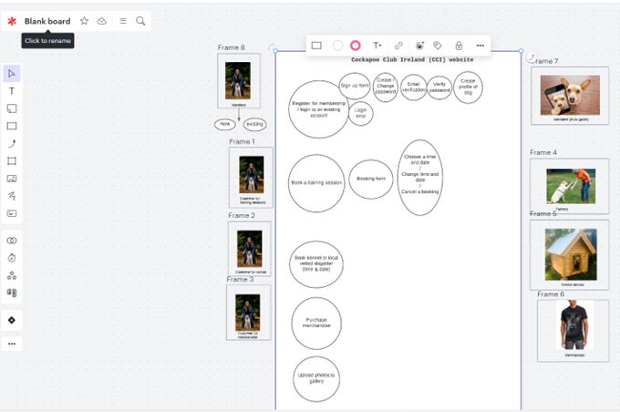

- ### User Story 1

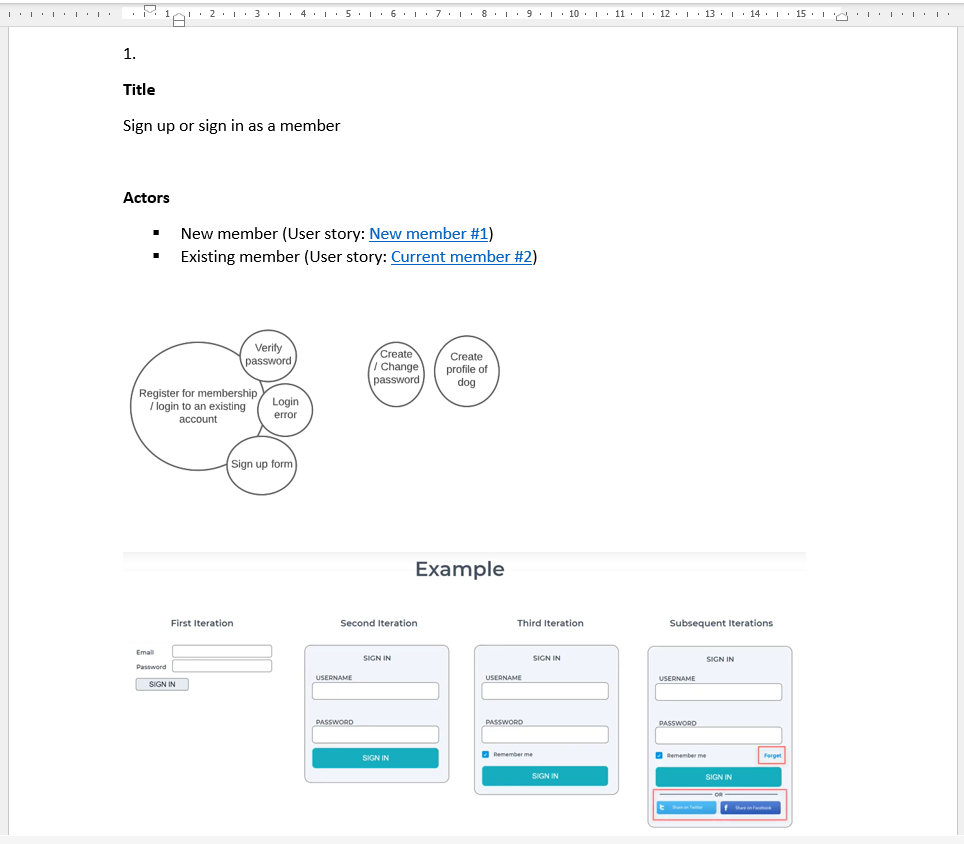

- ### User Story 2

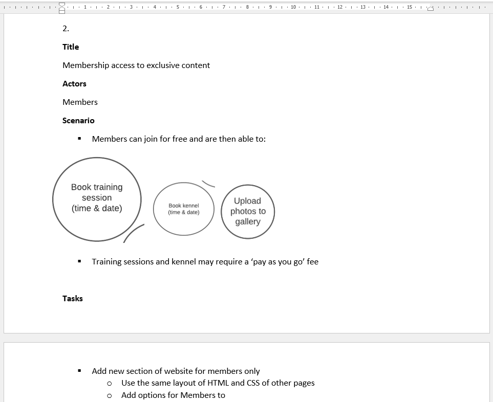

- ### User Story 3

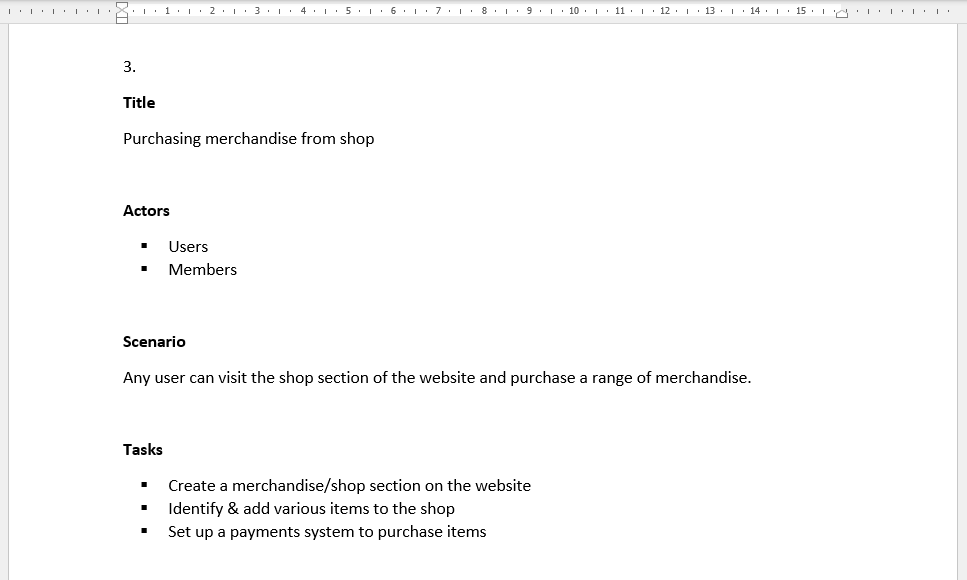

### **Agile project**

- As the project developed some details of the User stories were reviewed and revised. Changes were made to ensure the delivery of a Miminum Viable Product. For example, User Story 3 above became a fourth card that had to be moved to the Backlog column of the kanban board, and in a later iteration was moved into the To Do column. [Click Here](https://github.com/users/SamOBrienOlinger/projects/1) to visit this Github page

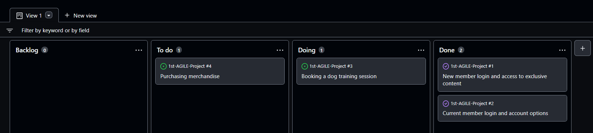 

## **[Deployment](#deployment)**

Cockapoo Club is deployed to Heroku, using an ElephantSQL Postgres database.
To duplicate deployment to Heroku, follow these steps:

- Fork or clone this repository in GitHub.
- You will need a Cloudinary account to host user images and static files.
- Login to Cloudinary.
- Select the 'dashboard' option.
- Copy the value of the 'API Environment variable' from the part starting `cloudinary://` to the end. You may need to select the eye icon to view the full environment variable. Paste this value somewhere for safe keeping as you will need it shortly (but destroy after deployment).
- Log in to Heroku.
- Select 'Create new app' from the 'New' menu at the top right.
- Enter a name for the app and select the appropriate region.
- Select 'Create app'.
- Select 'Settings' from the menu at the top.
- Login to ElephantSQL.
- Click 'Create new instance' on the dashboard.
- Name the 'plan' and select the 'Tiny Turtle (free)' plan.
- Select 'select region'.
- Choose the nearest data centre to your location.
- Click 'Review'.
- Go to the ElephantSQL dashboard and click on the 'database instance name' for this project.
- Copy the ElephantSQL database URL to your clipboard (this starts with `postgres://`).
- Return to the Heroku dashboard.
- Select the 'settings' tab.
- Locate the 'reveal config vars' link and select.
- Enter the following config var names and values:
    - `CLOUDINARY_URL`: *your cloudinary URL as obtained above*
    - `DATABASE_URL`: *your ElephantSQL postgres database URL as obtained above*
    - `PORT`: `8000`
    - `SECRET_KEY`: *your secret key*
- Select the 'Deploy' tab at the top.
- Select 'GitHub' and confirm you wish to deploy using GitHub. You may be asked to enter your GitHub password.
- Find the 'Connect to GitHub' section and use the search box to locate your repo.
- Select 'Connect' when found.
- Optionally choose the main branch under 'Automatic Deploys' and select 'Enable Automatic Deploys' if you wish your deployed site to be automatically redeployed every time you push changes to GitHub.
- Find the 'Manual Deploy' section, choose 'main' as the branch to deploy and select 'Deploy Branch'.
- Your site will shortly be deployed and you will be given a link to the deployed site when the process is complete.

<!-- Heroku
Navigate to your Heroku dashboard
Click "New" and select "Create new app".
New heroku
Input a meaningful name for your app and choose the region best suited to your location.
Create new app
Select "Settings" from the tabs.
Settings tab
Click "Reveal Config Vars".
Config vars button
Input all key-value pairs as necessary from the .env file. Ensure DEBUG and DEVELOPMENT are not included. Config vars
Click "Add buildpack".
Add buildpack
Add "python" from the list or search if necessary, remember to click save.
Select buildpacks
Select "Deploy" from the tabs.
Settings tab
Select "GitHub - Connect to GitHub" from deployment methods.
Select GitHub
Click "Connect to GitHub" in the created section.
Connect to GitHub
Search for the GitHub repository by name.
Click to connect to the relevant repo.
Either click Enable Automatic Deploys for automatic deploys or Deploy  Branch to deploy manually. Manually deployed branches will need re-deploying each time the repo is updated.
Heroku deploy branch
Click View to view the deployed site.
Heroku view
The live site can also be accessed from your repo in GitHub from the environments section of the repo. -->

## **[Features Left to Implement](#features-left-to-implement)**

- Ideas for future features include: 

	- A way for authenticated members to set up their own personal profile.
		
	- Another potential authenticated members only feature would be the ability to upload their photographs of their pets.
	
	- An online shop or commercial section of the page could also be built for all users to purchase various Cockapoo Club branded merchandise, such as dog toys, clothes and what you would generally find in a giftshop.
	
	- A live social media platform feed in the Furry Fun Foto Gallery page would build the community and strengthen relationships, with authenticated members only being able to comment on other members photographs and be able to share more information in real-time with each other.
	
	- A training video gallery for authenticated members to post their videos of progress they are making in training their pets would also add value to the overall UX.
	
	- A future feature I would like to implement if given the opportunity is a way for members to book dates and times for dog-sitters in their local community.
	
	- This website works on screens sizes of minimum width 320px. To make sure it works for smaller screen-sizes, such as smaller mobile devices, future media queries will need to be added for screens of maximum width 320px.
  

## **[Testing](#testing)**
   
 - **Validator Testing**

   - **HTML**

      * [Homepage](#homepage)

        
      
     * [New Cockaparents](#new-cockaparents)
        
        

     * [Keep Your Poo Healthy](#keep-your-poo-healthy)
        
        

     * [Furry Fun Foto Gallery](#furry-fun-foto-gallery)
        
        

     * [Join](#join)
        
        
      
      * Login(#login)    
        

   - **CSS**
     
        
    
    - **Python**

        

   - **Lighthouse**  
     
    - Mobile device
      
      * [Homepage](#homepage)

        
      
      * [New Cockaparents](#new-cockaparents)
          
        

      * [Keep Your Poo Healthy](#keep-your-poo-healthy)
          
        

      * [Furry Fun Foto Gallery](#furry-fun-foto-gallery)
          
        

      * [Join](#join)
          
        

      * Login(#login)    
      
        

      * Booking(#booking)    
        

    
    - Desktop 

      * [Homepage](#homepage)
          
        
      
      * [New Cockaparents](#new-cockaparents)
          
        

      * [Keep Your Poo Healthy](#keep-your-poo-healthy)
      
        

      * [Furry Fun Foto Gallery](#furry-fun-foto-gallery)

        

      * [Join](#join)
          
        

      * Login(#login)    
      
        

      * Booking(#booking)    
        

      * Sign out(#sign-out)

        

  - **Feature testing**

    Testing all interactive features involved manually clicking on every link on each page and CRUD functionality.

## **[Unfixed Bugs](#unfixed-bugs)**

  - In making the project responsive, it was suggested by tutors and students via Slack that I use flexbox. However, I think because flexbox was not covered in the modules, I quickly found that in trying to implement flexbox the ultimate result was I over-complicated issues for ensuring responsiveness. I spent far too much time trying to learn about and apply flexbox to all areas of the site which was not really necessary. With support from my mentor and Code Institute tutors, I was eventually able to undo the areas of code that were causing the most problems I was experiencing. 

  - Another issue faced in making the site more responsive was making sure to use dynamic units of measurement rather than fixed ones in the most appropriate places.  

  - There were two occasions where I experienced conflicts between my GitHub repository and my local one. I was unaware that having more than one Gitpod workspace open would cause significant issues with diverging main branches. A significant amount of time was spent on these occasions with Code Institute tutors fixing the conflicts that came with having to merge or reconcile branches.  

  - Significant bugs were also experienced when Github moved servers from eu34 to eu38, before I saved my progress, resulting in losing a significant number of hours of work over approximately a week. Code Institute tutors were very helpful with guiding me through the procedure for finding the last git push I had done and restoring that.  

  - When I used [Responsively App](https://responsively.app/) a bug showed up regarding the rendering of images in the Furry Fun Foto Gallery:

        

    However, when using Google Chrome Dev Tools there does not seem to be any issue at any screen size. So I asked friends and family members to view the website on their different devices to double-check this bug. As well as providing constructive criticism that can be seen in the [Users experience](#users-experience) section above, nobody reported this as an issue. I tested this on multiple browsers, including Mozzila and Microsoft Edge, and still no issue came up. If this is not an issue specific to the Responsively App then it is possible that this bug may continue to occur.    
    
## **[Technologies and Tools](#technologies-and-tools)**
     
- [Convertio](https://convertio.co/) was used to convert images from .jfif and .jpeg to .png for improving the lighthouse scores for each page.
- [nssport.com](https://nsspot.herokuapp.com/imagetowebp/) was used to convert images from .png to .webp for improving the lighthouse scores for each page.

- Psychopg 2
- unicorn
- dj-database-url
- Django-allauth
- Crispy Forms
- Django
- Heroku
- Cloudinary
- Postgres - later changed to elephant
- Elephant
- Gitpod
- Github
- Gitbash
- Google Chrome Dev Tools 
- Font Awesome 
- Prefixed by https://autoprefixer.github.io
- [Responsively App](https://responsively.app/)
- Languages used: 
     - HTML
     - CSS
     - Python

     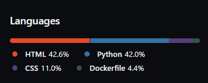

## **[Credits](#credits)**

- As a starting point I began with the HTML and CSS structure used in Code Institute's Love Running Project. I did this mainly because I thought the hero image with zoom was a great way to engage a new user. I also wanted to have a feature that allowed users to 'join' a club, so the Love Running project provided a good blueprint for adapting to the concept of a Cockapoo Club community.  

### **[Code](#code)**

- Below is the code for the cover text of JOIN COCKAPOO CLUB which immediately presents the user with a call to action that encourages them to visit the page allowing them to sign up and become a member of this unique community. This was based on the same feature used in the Code Institute's Love Running Project module:   
~~~
    #cover-text {
    font-size: 130%;
    font-family: Oswald, sans-serif;
    text-transform: uppercase;
    letter-spacing: 4px;
    width: 300px;
    height: 200px;
    padding-top: 40px;
    padding-left: 10px;
    background-color: rgba(241, 109, 107, .7);
    bottom: 30px;
    right: 150px;
    position: absolute;
    }
~~~
  - Code for the opening times of the Cockapoo Clubhouse and Training Centre was initally taken from the Code Institute's Coders Coffeehouse practical examples. The details have been altered to make it relevant to this project and styled differently using CSS. The following code can be found on lines 101 to 121 [Here](https://github.com/aoifesmith/CodersCoffeehouse/blob/master/index.html).  

~~~
  

		<h2 class="text-center">Open times</h2>

		<table class="text-center">
		<tr>
			<th></th>
			<th>Open</th>
			<th>Close</th>	
		</tr>
		<tr>
			<td>Mon - Fri</td>
			<td>09:00</td>
			<td>21:00</td>
		</tr>
		<tr>
			<td>Weekend</td>
			<td>10:00</td>
			<td>22:00</td>
		</tr>	
		</table>
	

~~~

 - The original HTML code for the footer was:
~~~
<footer>
        <ul>
            <li>
                <a href="https://facebook.com" target="_blank" rel="noopener"
                    aria-label="Visit our Facebook page (opens in a new tab)"><i class="fab fa-facebook"></i></a>
            </li>
            <li>
                <a href="https://twitter.com" target="_blank" rel="noopener"
                    aria-label="Visit our Twitter page (opens in a new tab)"><i class="fab fa-twitter-square"></i></a>
            </li>
            <li>
                <a href="https://youtube.com" target="_blank" rel="noopener"
                    aria-label="Visit our YouTube page (opens in a new tab)"><i class="fab fa-youtube-square"></i></a>
            </li>
            <li>
                <a href="https://instagram.com" target="_blank" rel="noopener"
                    aria-label="Visit our Instagram page (opens in a new tab)"><i class="fab fa-instagram"></i></a>
            </li>
        </ul>
  </footer>
~~~

   While the above code is essentially the same for most of the footer in this project, I added two elements for this project to engage the user more. In this project the footer also contains an email address to contact Cockapoo Club and another call to action to join as a new member of Cockapoo Club.

### **Content**

   - information and text were gathered from the following websites:

      - [zigzag.dog](https://zigzag.dog/guide-how-to-train-cockapoo-puppy/)
      - [Hillspet](https://www.hillspet.com/new-pet-parent/dog#faqs)
      - [Wikipedia](https://en.wikipedia.org/wiki/Cockapoo) 
      - [YouTube](https://youtu.be/Fe-sa9mHcxI )

  - Styling and instructions on how to construct form validation on the join-form.html page was based on the form found in the Code Institute Love Running Project module: [Signup Form: Challenge 1](https://learn.codeinstitute.net/courses/course-v1:CodeInstitute+LR101+2021_T1/courseware/4a07c57382724cfda5834497317f24d5/4d85cd1a2c57485abbd8ccec8c00732c/?child=first). 

- The icons in the footer were taken from [Font Awesome](https://fontawesome.com/)
     
   
 - **[Images](#used-images)**

    - The photos used on the main pages are from various open-source sites. The background image for join-form.html is my own. The other images on the main pages were sourced from the following places:

      - [unsplash](https://unsplash.com/photos/KVeogBZzl4M) 
      - [unsplash](https://unsplash.com/photos/T2ld_5QnZBQ) 
      - [pixabay](https://pixabay.com/photos/beach-dog-ball-cockapoo-puppy-2427290/) 
      - [pixabay](https://pixabay.com/photos/beach-dog-water-sea-reflection-2239428/)
      
      - Images for the [Furry Fun Foto Gallery](https://home-cockapoo-club-pp4.herokuapp.com/furryFunFotoGallery/g) are a combination of my own and others found on the following sites:

        - [pxfuel](https://www.pxfuel.com/en/search?q=Cockapoo)
        - [ukpets](https://www.ukpets.com/blog/how-much-is-a-cockapoo) 

 - **Video**

    - The YouTube video embedded in the [Keep Your Poo Healthy](https://samobrienolinger.github.io/Cockapoo-Club/keep-your-poo-healthy.html#jump-to-kyph) page was taken from [Hills Pet](https://www.hillspet.com) and can be found at https://youtu.be/Fe-sa9mHcxI 

## **[Acknowledgements](#acknowledgements)**

   - The [README template](https://github.com/Code-Institute-Solutions/readme-template) provided by Code Institute was very helpful as a model for developing this README file.  

  - My mentor, [Sandeep Aggarwal](https://code-institute-room.slack.com/team/UHEGTP519), as well as a number of Code Institute Tutors and students were very supportive via slack and the Student Support Chat. 
   
  - The following Code Institute Alumni, Tutors and Students helped guide me and to tease out a range of issues I faced developing the project: 
     
      - [Alex_alumnus](https://code-institute-room.slack.com/team/U01PDEMPJ87)
      - [Gaff C-Lead, Mentor](https://code-institute-room.slack.com/team/UU5GAMEJV)
      - [Tony-Albanese](https://code-institute-room.slack.com/archives/D04L1BCQ2UC/p1674319883425119)
      - [Andy_Guttridge-5p](https://code-institute-room.slack.com/team/U028ET3Q37A)
      - [Ed-ci](https://code-institute-room.slack.com/team/U02FJ8V7NA2)
      - [Jo_ci](https://code-institute-room.slack.com/team/U01MQ6TQUPQ)
      - [Rebecca_ci](https://code-institute-room.slack.com/team/U02NKD296N5)
      - [Alan_ci](https://code-institute-room.slack.com/team/U01FHTDF0RE)
      - [Roman-Rakic](https://code-institute-room.slack.com/team/U0399DYN9AM)
     

**[Click Here](#contents)** to return to Contents
